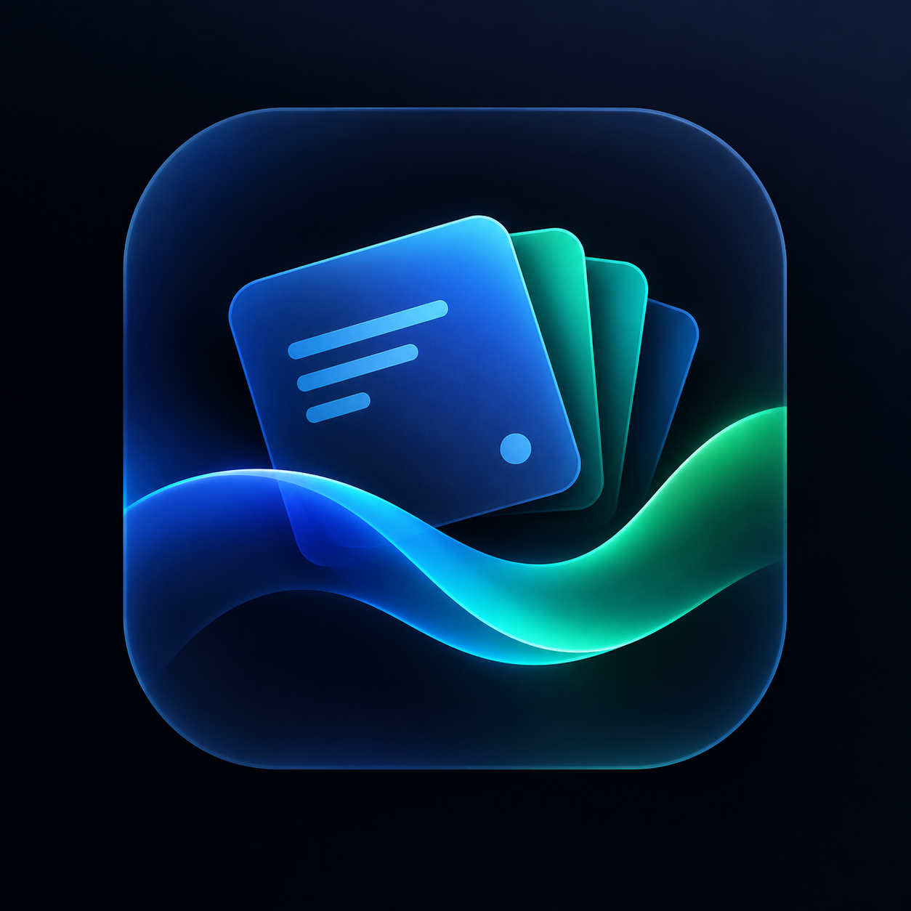

# Flashcards • Offline Reader

<div align="center">
  
  <p><em>An ultra-luxurious, distraction-free, local-first flashcard companion built with tactile Apple-inspired matte aesthetics, 3D cylindrical deck carousels, physics-based gesture navigation, resilient CSV parsing, offline KaTeX typesetting, and procedural fluid ambient lighting.</em></p>
  
  <p>
    
    
    
    
  </p>
</div>

---

## Table of Contents

1. [Overview](#overview)
2. [Key Architectural Highlights](#key-architectural-highlights)
3. [Comprehensive Feature Breakdown](#comprehensive-feature-breakdown)
4. [Project File Structure](#project-file-structure)
5. [Running Locally & Offline Installation](#running-locally--offline-installation)
6. [Study Deck Format (CSV Specifications)](#study-deck-format-csv-specifications)
7. [Touch Gestures & Keyboard Shortcuts](#touch-gestures--keyboard-shortcuts)
8. [Author & Official Links](#author--official-links)

---

## Overview

**Flashcards Reader** is a high-performance, local-first web application engineered for focused learning and deep memorization. Designed with absolute privacy in mind, it operates entirely client-side with zero external network dependencies, remote databases, accounts, or tracking cookies. 

Every interaction—from the 3D spring card flips and momentum-driven deck carousels to the frosted glass bottom sheets and high-resolution performance report exports—is meticulously optimized for responsiveness across mobile, tablet, and desktop devices.

---

## Key Architectural Highlights

* **Zero-Network Dependency**: Fully capable of offline operation via service-worker friendly asset bundling and embedded KaTeX libraries.
* **Dual-Tier Persistent Storage**: Integrates asynchronous **IndexedDB** multi-deck storage with browser storage persistence requests (`navigator.storage.persist()`) to guarantee that user study data and deck vaults are never purged during memory reclamation.
* **Automatic Session Recovery**: Restores exact active study state, card index positions, and score metrics upon browser reopening or tab refreshing.
* **Procedural Ambient Lighting Engine**: A dynamic HTML5 canvas background rendering organic fluid color nodes that react to custom velocity and intensity settings.

---

## Comprehensive Feature Breakdown

### 1. Multi-Deck Vault & 3D Cylindrical Carousel
* **Peek Preview Carousel**: The library viewport renders a 3D cylindrical pack layout where adjacent decks and the "+ New Deck" card gracefully peek out from the left and right edges, providing an intuitive cue for horizontal swiping.
* **Scalable Vault Capacity**: Effortlessly manage up to 10+ custom study packs with real-time card counters, local storage verification pills, and smooth cinematic transition blurs upon launch.

### 2. Interactive Deck Editing & Secure Deletion
* **Pencil Edit Control**: Tapping the edit icon on any deck card opens a responsive bottom sheet allowing users to instantly rename the deck title or replace its cover artwork.
* **Confirmation Guardrails**: Destructive actions like deck deletion or database factory resets are safeguarded behind explicit confirmation dialogs to prevent accidental data loss.

### 3. Resilient CSV Validation & Frosted Notification Banner
* **Syntax & Quote Verification**: Inspects uploaded `.csv` or `.txt` files line-by-line before parsing to detect unclosed quotation marks or corrupted comma delimiters.
* **Glassmorphic Toast Banners**: Delivers parsing warnings and success notices inside Apple-styled frosted glass alerts equipped with auto-dismiss timers and manual close triggers.

### 4. Apple-Inspired Matte & Glass Architecture
* **Obsidian Canvas**: Optimized dark-mode color palettes engineered to reduce eye fatigue during prolonged late-night study sessions.
* **Specular Rim Lighting**: Cards and control docks feature subtle frosted specular highlights that respond cleanly to dark environments.

### 5. Physical Card Gestures & Glowing Q/A Indicators
* **Glowing Indicator Lights**: Cards feature distinct, glowing status pills—an amber-lit pill for **Question** fronts and an emerald-lit pill for **Answer** backs—providing instant visual clarity.
* **3D Spring Card Flip**: Cards pivot along the Y-axis using custom physics spring curves (`cubic-bezier(0.175, 0.885, 0.32, 1.15)`).
* **Directional Gesture Rating**: 
  * **Swipe Right**: Mark card as **Got It** (Mastered).
  * **Swipe Left**: Mark card as **Needs Work** (Needs Review).
* **Live Backlight Illumination**: Ambient edge glows shift dynamically to emerald green or soft coral red as cards are pulled sideways.

### 6. Grabbable Bottom Sheets & Universal Backdrop Controls
* **Drag-to-Dismiss Handles**: All modal sheets (Create, Edit, Preferences, About, Confirmations) include enlarged, responsive handle bars and header zones supporting touch and mouse dragging to easily pull down and minimize.
* **Universal Backdrop Closure**: Tapping anywhere outside an active sheet or modal instantly dismisses it.

### 7. Integrated KaTeX Mathematical Typesetting
* **Offline LaTeX Support**: Native client-side rendering for complex scientific and mathematical formulas without requiring internet connectivity.
* **Delimiter Support**: Wrap block equations in `$$...$$` and inline symbols in `$...$`.

### 8. Session Breakdown & High-Resolution Export
* **Completion Summary**: Displays overall mastery percentages, correct-to-review ratios, and animated metric rings.
* **Targeted Missed Study**: Review cards marked as "Needs Work" with a single tap.
* **Studio-Quality Image Export**: Automatically renders a high-resolution 1080×1350 score report image complete with radial gauges and timestamps for instant sharing or saving.

---

## Project File Structure

```text
FLASHCARD-READER/
├── .github/
│   └── workflows/
│       └── build.yml             # Automated CI/CD workflow configuration
├── INSTALLATION/
│   └── Flashcard-Reader-apk.zip  # Ready-to-install Android application package
├── app.js                        # Core application logic, IndexedDB, and gesture engine
├── CNAME                         # Custom domain configuration for Surge & GitHub Pages
├── config.xml                    # Cordova/App packaging configuration
├── icon.png                      # Official application and website logo asset
├── index.html                    # Main application markup, views & modal templates
├── LICENSE                       # Open-source MIT license agreement
├── README.md                     # Project documentation
 style.css                     # Design system, glassmorphism, 3D transforms & themes

└── version.json
